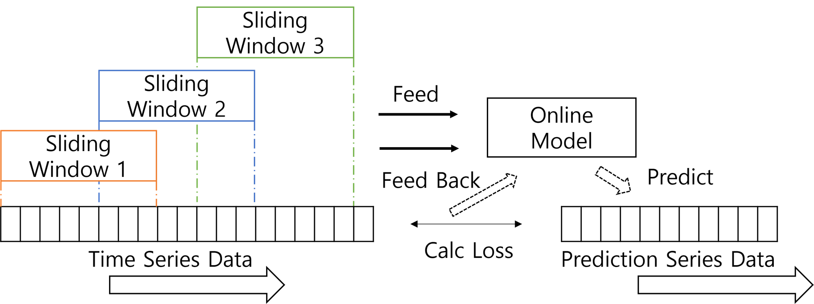

# online trainer

해당 프로젝트는 오프라인 학습된 모델을 불러와 온라인 학습과 예측 데이터를 생성합니다.



## 1. 주요 기능
1. model repository로부터 학습된 **offline모델**과 **minmaxScaler**를 불러옵니다.
2. Kafka Pipeline으로부터 실시간 데이터를 Consume합니다.
3. 실시간으로 들어오는 데이터를 mini batch화하여 Sliding Window를 구성합니다.
4. Sliding Window가 지정된 크기를 넘어서면 예측값을 생성하고 실제 데이터와 비교하여 모델 가중치를 업데이트합니다.

## 2. 시작하기 전 준비사항
이 프로젝트는 Python 3.7 버전에서 진행하였습니다.<br><br>

- Python == 3.7 //3.8 이상 버전에서 LSTM모델 버그가 존재합니다.
- Python package findspark, pyspark, torch==1.7.1, torchvision==0.8.2, influxdb


## 3. 시작하기
### 3.1 프로젝트 클론
다음과 같이 프로젝트를 받아주세요.
``` sh
$ mkdir {YOUR_DESIRED_PATH} && cd {YOUR_DESIRED_PATH}
$ git clone 
$ cd online
```
### 3.2 환경 구성
가상환경 사용을 권장합니다.
``` sh
$ python -m venv {YOUR_VENV_NAME} # Recommeded
$ source ./{YOUR_VENV_NAME}/bin/activate
$ pip install findspark pyspark torch==1.7.1 torchvision==0.8.2 influxdb
```
### 3.3 온라인 학습
``` sh
$ python online_trainer.py {DB} {TABLE} {FeatureName}
```

## 4. 라이센스
This project is licensed under the terms of the [**APACHE LICENSE, VERSION 2.0**](https://www.apache.org/licenses/LICENSE-2.0.txt).
